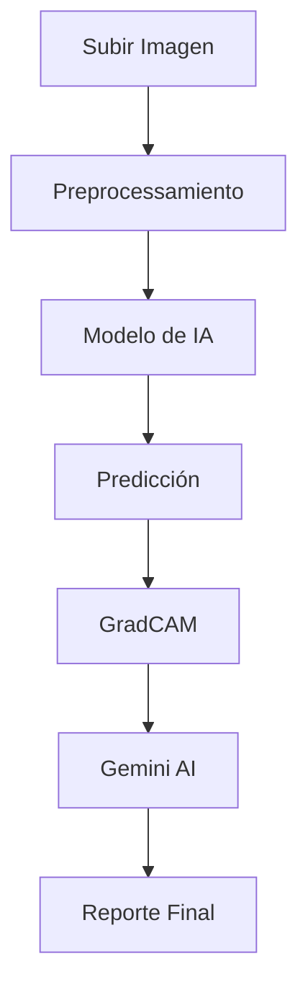

# 🏥 DermaIA - Sistema de Diagnóstico Dermatológico con Inteligencia Artificial


## 📋 Descripción

**DermaIA** es un sistema avanzado de diagnóstico dermatológico que utiliza inteligencia artificial para analizar imágenes de lesiones cutáneas y proporcionar diagnósticos preliminares. El sistema está diseñado como una herramienta de apoyo para profesionales de la salud, ofreciendo análisis rápidos y precisos de hasta 25 condiciones dermatológicas diferentes.

### 🎯 Características Principales

- **Análisis de IA Avanzado**: Modelo de deep learning entrenado para detectar 25 condiciones dermatológicas
- **Visualización GradCAM**: Mapas de calor que muestran las áreas de interés del modelo
- **Gestión de Pacientes**: Sistema completo de registro y seguimiento de pacientes
- **Reportes Detallados**: Generación automática de reportes en PDF
- **Integración con Gemini AI**: Descripción y recomendaciones de tratamiento generadas por IA
- **Interfaz Moderna**: Diseño responsivo y fácil de usar
- **Autenticación Segura**: Sistema de login y gestión de usuarios

## 🔬 Condiciones Dermatológicas Detectadas

El sistema puede identificar las siguientes 25 condiciones:

| Código | Condición                      | Descripción                            |
| ------ | ------------------------------ | -------------------------------------- |
| MEL    | Melanoma                       | Tipo de cáncer de piel                 |
| NV     | Nevus                          | Lunar benigno                          |
| BCC    | Carcinoma de células basales   | Cáncer de piel no melanoma             |
| AK     | Queratosis actínica            | Lesión precancerosa                    |
| BKL    | Queratosis benigna             | Lesión benigna                         |
| DF     | Dermatofibroma                 | Tumor benigno                          |
| VASC   | Lesiones vasculares            | Afecciones de vasos sanguíneos         |
| SCC    | Carcinoma de células escamosas | Cáncer de piel                         |
| ACN    | Acné                           | Afección inflamatoria                  |
| ROS    | Rosácea                        | Enfermedad inflamatoria crónica        |
| DER    | Dermatitis                     | Inflamación de la piel                 |
| ECZ    | Eczema                         | Dermatitis atópica                     |
| PSO    | Psoriasis                      | Enfermedad autoinmune                  |
| IMP    | Impétigo                       | Infección bacteriana                   |
| CEL    | Celulitis                      | Infección del tejido subcutáneo        |
| RIN    | Tiña                           | Infección fúngica                      |
| HER    | Herpes                         | Infección viral                        |
| LUP    | Lupus                          | Enfermedad autoinmune                  |
| HIV    | VIH-relacionado                | Manifestaciones cutáneas del VIH       |
| WAR    | Verrugas                       | Infección viral                        |
| SCA    | Sarna                          | Infestación parasitaria                |
| VAS    | Vasculitis                     | Inflamación de vasos sanguíneos        |
| CPX    | Varicela                       | Infección viral                        |
| SHG    | Herpes zóster                  | Reactivación del virus varicela-zóster |
| UNK    | Desconocido                    | Condición no identificada              |

## 🏗️ Arquitectura del Sistema

### Tecnologías Utilizadas

**Backend:**

- **Django 5.2.1** - Framework web principal
- **TensorFlow/Keras** - Modelo de inteligencia artificial
- **Google Generative AI (Gemini)** - Generación de reportes y recomendaciones
- **OpenCV** - Procesamiento de imágenes
- **PostgreSQL/SQLite** - Base de datos

**Frontend:**

- **HTML5/CSS3** - Estructura y estilos
- **JavaScript** - Interactividad
- **Bootstrap** - Framework CSS responsivo
- **Font Awesome** - Iconografía

**IA y Machine Learning:**

- **MobileNetV2** - Arquitectura base del modelo
- **GradCAM** - Visualización de activaciones
- **CustomF1Score** - Métrica personalizada de evaluación

### Estructura del Proyecto

```
Proyecto_Final_IA_Dermatologia/
├── apps/
│   ├── auth/                   # Autenticación y usuarios
│   ├── core/                   # Funcionalidades principales
│   └── Dermatologia_IA/        # Módulo principal de IA
│       ├── models.py           # Modelos de datos
│       ├── views/              # Vistas de la aplicación
│       ├── forms/              # Formularios
│       ├── migrations/         # Migraciones de BD
│       └── utils/              # Utilidades
├── IA/
│   └── Dermatological_AI_Model/
│       └── checkpoints/        # Modelo entrenado
├── media/                      # Archivos multimedia
│   ├── skin_images/           # Imágenes de lesiones
│   └── gradcam_images/        # Mapas de calor
├── static/                     # Archivos estáticos
│   ├── css/                   # Estilos CSS
│   ├── js/                    # JavaScript
│   └── img/                   # Imágenes
├── templates/                  # Plantillas HTML
├── utils/                      # Utilidades generales
├── manage.py                   # Script de Django
└── requirements.txt            # Dependencias
```

## 🚀 Instalación y Configuración

### Prerrequisitos

- Python 3.10 o superior
- pip (gestor de paquetes de Python)
- Git

### Pasos de Instalación

1. **Clonar el repositorio**

```bash
git clone https://github.com/tu-usuario/Proyecto_Final_IA_Dermatologia.git
cd Proyecto_Final_IA_Dermatologia
```

2. **Crear entorno virtual**

```bash
python -m venv derma_env
# En Windows:
derma_env\Scripts\activate
# En Linux/Mac:
source derma_env/bin/activate
```

3. **Instalar dependencias**

```bash
pip install -r requirements.txt
```

4. **Configurar variables de entorno**
   Crear un archivo `.env` en la raíz del proyecto:

```env
DJANGO_SECRET_KEY=tu_clave_secreta_aqui
GEMINI_API_KEY=tu_api_key_de_gemini
DEBUG=True
```

5. **Configurar base de datos**

```bash
python manage.py makemigrations
python manage.py migrate
```

6. **Crear superusuario**

```bash
python manage.py createsuperuser
```

7. **Ejecutar servidor de desarrollo**

```bash
python manage.py runserver
```

El sistema estará disponible en `http://localhost:8000`

## 🔧 Configuración Adicional

### Modelo de IA

El modelo entrenado debe ubicarse en:

```
IA/Dermatological_AI_Model/checkpoints/MODELO_IA_DERMATOLOGICO.keras
```

### API de Gemini

Para obtener descripciones y tratamientos generados por IA:

1. Registrarse en [Google AI Studio](https://aistudio.google.com/)
2. Obtener una API key
3. Configurar la variable `GEMINI_API_KEY` en el archivo `.env`

## 📱 Uso del Sistema

### 1. Registro e Inicio de Sesión

- Crear cuenta de usuario
- Iniciar sesión con credenciales

### 2. Gestión de Pacientes

- Registrar nuevos pacientes
- Buscar pacientes existentes
- Editar información de pacientes

### 3. Análisis Dermatológico

1. **Subir Imagen**: Seleccionar imagen de lesión cutánea
2. **Seleccionar Paciente**: Elegir paciente existente o crear nuevo
3. **Indicar Localización**: Especificar zona anatómica
4. **Analizar**: El sistema procesa la imagen con IA
5. **Ver Resultados**: Obtener diagnóstico, confianza y visualización

### 4. Reportes

- Visualizar resultados detallados
- Descargar reportes en PDF
- Enviar reportes por email
- Consultar historial de análisis

## 📊 Flujo de Análisis



1. **Preprocessamiento**: La imagen se redimensiona a 224x224 y se normaliza
2. **Predicción**: El modelo MobileNetV2 personalizado clasifica la imagen
3. **GradCAM**: Se genera un mapa de calor mostrando las áreas importantes
4. **Gemini AI**: Se genera descripción y recomendaciones de tratamiento
5. **Almacenamiento**: Los resultados se guardan en la base de datos

## 🔒 Seguridad

- **Autenticación requerida**: Todos los endpoints requieren login
- **Validación de datos**: Formularios con validación robusta
- **Middleware de sesión**: Control de timeout de sesión
- **Validación de archivos**: Solo imágenes permitidas (JPG, PNG, JPEG)
- **Sanitización**: Prevención de inyecciones y XSS

## 📈 Características Técnicas

### Modelo de IA

- **Arquitectura**: MobileNetV2 con capas personalizadas
- **Entrada**: Imágenes RGB de 224x224 píxeles
- **Salida**: Probabilidades para 25 clases
- **Métrica**: F1-Score personalizado para evaluación multiclase

### Rendimiento

- **Tiempo de análisis**: ~2-5 segundos por imagen
- **Precisión del modelo**: Configurado con métricas F1
- **Soporte concurrente**: Múltiples usuarios simultáneos

### Base de Datos

- **Modelos principales**:
  - `Patient`: Información de pacientes
  - `SkinImage`: Imágenes y resultados de análisis
- **Relaciones**: Un paciente puede tener múltiples análisis
- **Validaciones**: Campos únicos (DNI, email, teléfono)

## 🐛 Solución de Problemas

### Problemas Comunes

**Error: Modelo no encontrado**

```bash
# Verificar ruta del modelo
ls IA/Dermatological_AI_Model/checkpoints/
```

**Error: Gemini API no disponible**

- Verificar API key en archivo `.env`
- Comprobar conectividad a internet

**Error: Imagen no se procesa**

- Verificar formato de imagen (JPG, PNG, JPEG)
- Comprobar tamaño máximo (5MB)

## 🤝 Contribución

1. Fork el proyecto
2. Crear rama feature (`git checkout -b feature/AmazingFeature`)
3. Commit cambios (`git commit -m 'Add some AmazingFeature'`)
4. Push a la rama (`git push origin feature/AmazingFeature`)
5. Abrir Pull Request

## 📄 Licencia

Este proyecto está bajo la Licencia MIT. Ver el archivo `LICENSE` para más detalles.

## 👥 Autores

- **Gabriel** - Desarrollo principal - [GitHub](https://github.com/tu-usuario)

## 🙏 Agradecimientos

- Dataset de entrenamiento de lesiones dermatológicas
- Comunidad de TensorFlow y Django
- Google Generative AI por la API de Gemini
- Bibliotecas de código abierto utilizadas

## 📞 Soporte

Para soporte técnico o preguntas:

- 📧 Email: support@dermaia.com
- 📱 Teléfono: +593 99 999 9999
- 💬 Issues: [GitHub Issues](https://github.com/tu-usuario/Proyecto_Final_IA_Dermatologia/issues)

---

⚠️ **Aviso Importante**: Este sistema es una herramienta de apoyo diagnóstico y no reemplaza el criterio médico profesional. Siempre consulte con un dermatólogo calificado para diagnósticos definitivos.

---

Desarrollado con ❤️ para mejorar el diagnóstico dermatológico mediante IA.
